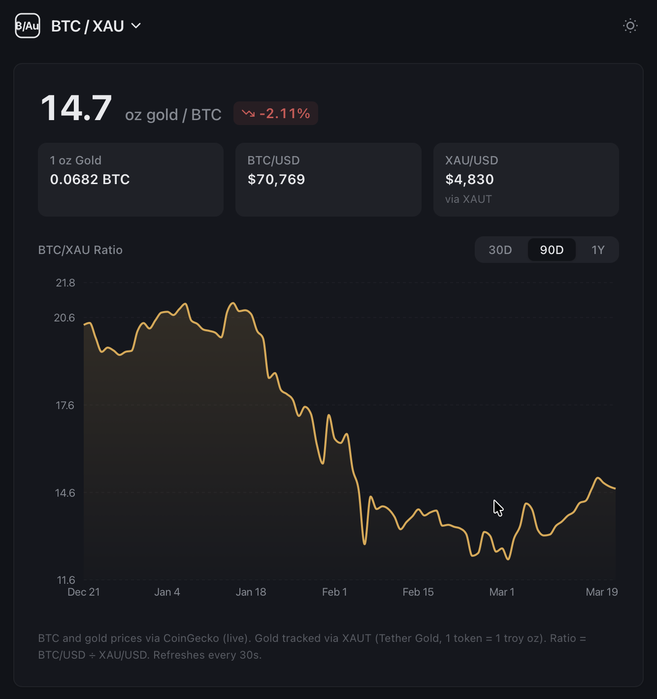
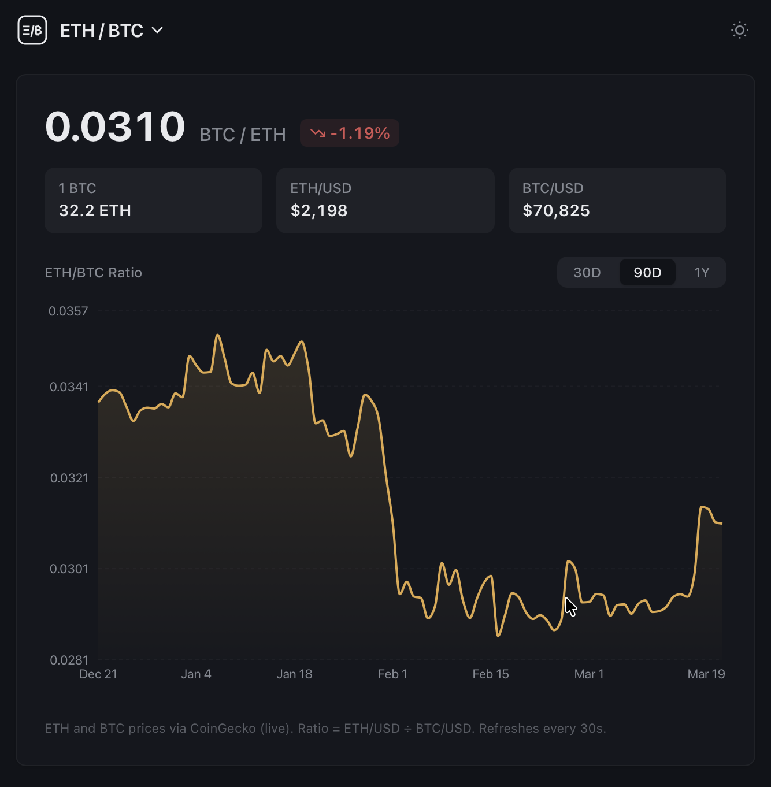
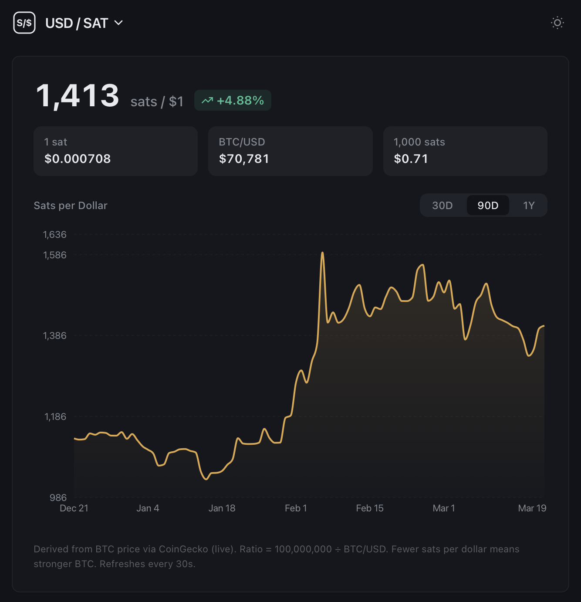

# Crypto Dashboard

Live ratio dashboard tracking Bitcoin against gold (XAU), Ethereum against Bitcoin (ETH/BTC), and USD against satoshis — all in one place.

## Screenshots

| BTC / XAU | ETH / BTC | USD / SAT |
|-----------|-----------|-----------|
|  |  |  |

## Widgets

| Widget | What it shows |
|--------|--------------|
| BTC / XAU | How many troy oz of gold one Bitcoin buys |
| ETH / BTC | ETH price denominated in BTC |
| USD / SAT | How many satoshis one US dollar buys |

Switch widgets from the dropdown in the header. The selected widget and chart range are preserved in the URL (`?widget=&range=`).

## Stack

- **Next.js 16** (App Router, Turbopack)
- **React 19** + **TanStack Query v5**
- **Recharts** for charts
- **Tailwind CSS v4**
- **pnpm** monorepo (`apps/web`, `packages/utils`)

## Data

Prices are fetched from the [CoinGecko public API](https://www.coingecko.com/en/api):

- Bitcoin and Ethereum via their native coin IDs
- Gold via `tether-gold` (XAUT — 1 token = 1 troy oz)

Current prices refresh every 30 seconds. Historical data (365 days, daily) is cached for 3 hours via Next.js Data Cache.

## Getting Started

```bash
pnpm install
pnpm dev
```

Open [http://localhost:3000](http://localhost:3000).

### Build

```bash
pnpm build
pnpm start
```

## Project Structure

```
btc-xau-dashboard/
├── apps/
│   └── web/                  # Next.js app
│       └── src/
│           ├── app/
│           │   ├── api/
│           │   │   ├── btc-xau/  # current + history routes
│           │   │   └── eth-btc/  # current + history routes
│           │   └── page.tsx
│           ├── components/
│           │   └── Dashboard.tsx
│           └── hooks/
│               ├── useBtcXauData.ts
│               └── useEthBtcData.ts
└── packages/
    └── utils/                # Shared formatters (formatUsd, formatPercent, formatUsdCents)
```
